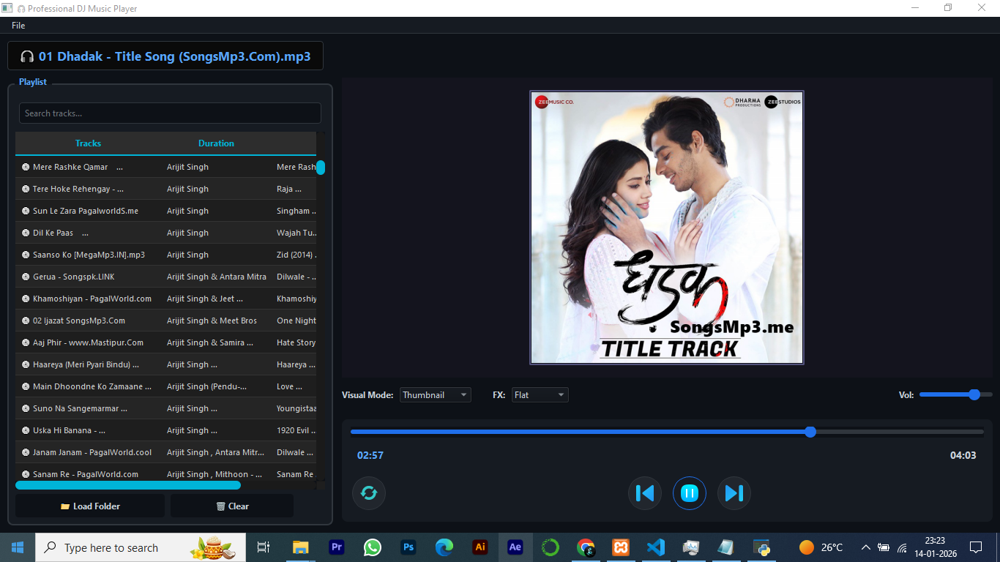
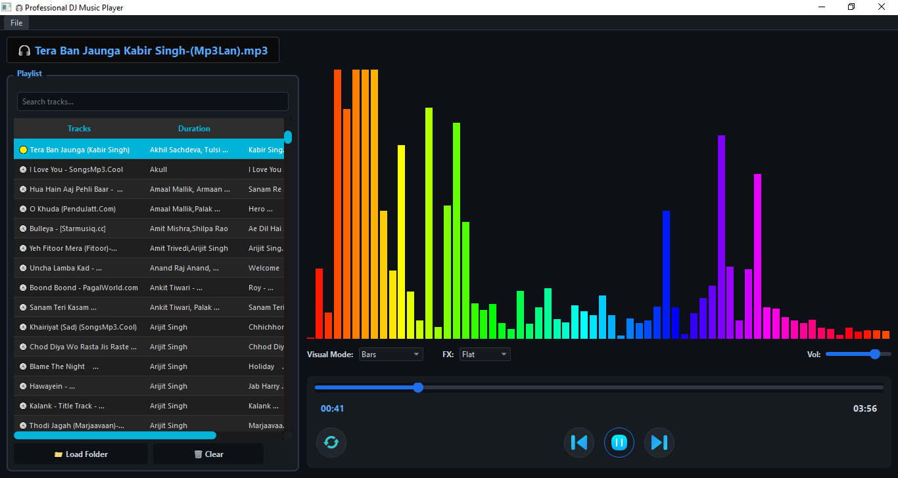
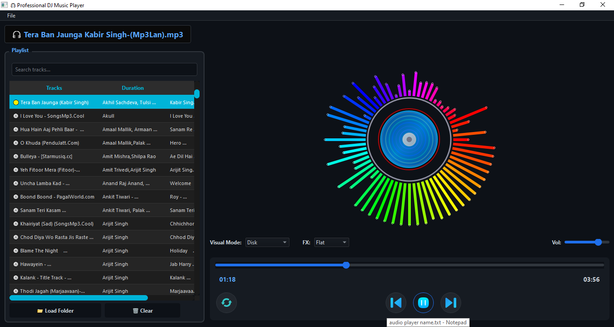

# 🎧 SonicDive – 8D Music Player

SonicDive is an immersive **audio visualization & effects-based music player** designed to deliver a next-level listening experience.  
It combines **dynamic spectrums** with **advanced spatial audio effects** like **3D & 8D sound**.

---

## ✨ Features

### 🎵 Audio Visual Spectrums
SonicDive supports multiple real-time audio visualizations:

- 💿 **Disk Spectrum**
- 📊 **Bars Spectrum**
- 🌊 **Wave Spectrum**
- 🖼️ **Thumbnail Spectrum**
- ⭕ **Circle Spectrum**

Each spectrum reacts dynamically to the music’s frequency and intensity.

---

### 🎚️ Audio Effects & Modes
Choose from a variety of sound profiles to match your mood:

- 🔊 **Flat**
- 🎧 **3D Audio**
- 🎧 **8D Audio**
- 🎤 **Hip-Hop**
- 🎻 **Classic**
- 🎸 **Rock**
- 🎥 **Dolby Effect**

---

## 🚀 Highlights

- Real-time audio visualization
- Immersive spatial sound effects
- Smooth transitions between spectrums
- Lightweight & responsive
- Headphone-optimized for best 8D experience

---

## 🖥️ Screenshots / Demo

> *(Add screenshots or GIF demos here)*

## 📜 License

This project is licensed under the [MIT License](LICENSE).

## 🤝 Contributing

Feel free to **fork** the repository and submit **pull requests** to enhance functionality or fix issues.

## 📞 Contact

For support or inquiries, reach out via **GitHub Issues** or email **[********[tejaschavda2020@gmail.com](mailto\:tejaschavda2020@gmail.com)********]**.

---

*Developed with ❤️ using CodeIgniter.*

